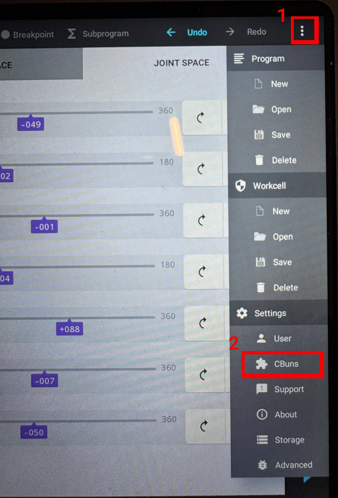
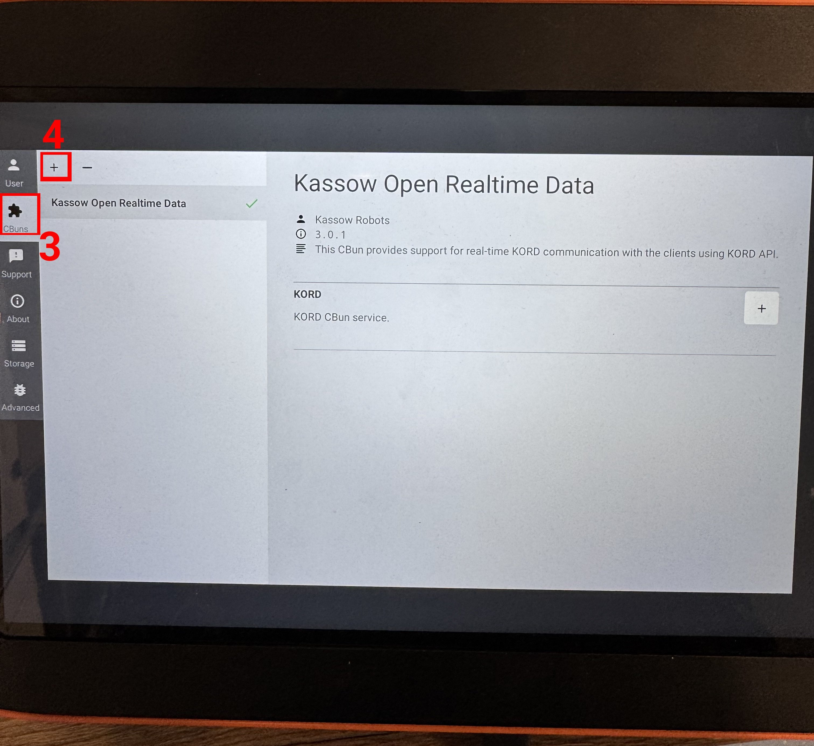
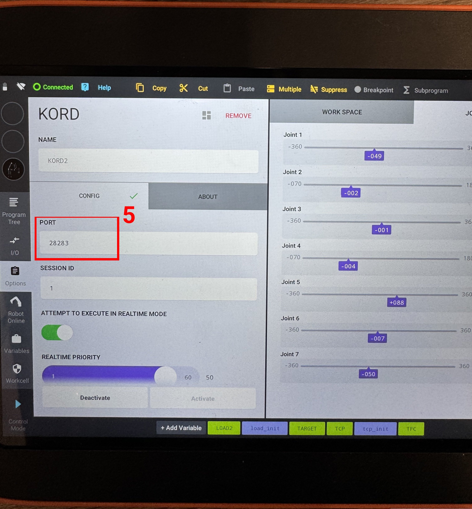

# kassow kord driver

This repository contains the configuration and setup for Kassow Kord control, which demonstrates the use of a b»controlled box for robotic tasks.

> [!WARNING]
> This repository is under heavy development. If some links break or if some instruction do not lead to a smooth experience, please contact the developers.

## Overview

This package provides a software solution for controlling Kassow Kord Robot (KR810) using KORD interface. It integrates with ros2_control and provides motion planning capabilities.

**Primary Capabilities:**

- Control of Kassow KR810 collaborative robots through a custom hardware interface and Joint Trajectory Controller
- Multi-robot setup to control both real and simulated robot simultaneously or independently on b»controlled box.
- Integration with MoveIt 2 for motion planning and trajectory execution

**Developer Notes**

- This workspace is setup for single or double arm control. We use prefix to specify all joints, joint limits, srdf, controller names and so on. Better not touch the prefixes, but if you do prepare to update moveit configs and controllers.yaml
  - single arm: `kassow` prefix is used.
  - dual arm: `kassow_left` for sim and `kassow_right` for robot prefixes are used.

**Package Structure**

```bash
├── kassow_kord_bringup —                                 # Bringup package containing launch files and configs for running all package capabilities
│   ├── config                                            # YAML configuration files for control
│   ├── launch                                            # Launch files to start drivers, controllers, MoveIt and RViz
│   │   ├── kassow_kord_bringup_mock.launch.xml           # Launch the single-arm stack with mock hardware for development and testing
│   │   ├── kassow_kord_cm.launch.xml                     # Running Controller Manager locally in case of not using CtrlX for single-arm mode
│   │   ├── kassow_kord_description.launch.xml            # Load URDF and RSP nodes for single-arm
│   │   ├── kassow_kord_dual_arm_bringup_mock.launch.xml  # Launch the dual-arm setup using mock hardware for simulation/testing
│   │   ├── kassow_kord_dual_arm_cm.launch.xml            # Running Controller Manager locally in case of not using CtrlX for dual-arm mode
│   │   ├── kassow_kord_dual_arm_description.launch.xml   # Load URDF and RSP nodes for dual-arm setups
│   │   ├── kassow_kord_dual_arm_moveit.launch.xml        # Start MoveIt2 for the dual-arm configuration
│   │   ├── kassow_kord_moveit.launch.xml                 # Start MoveIt2 for single-arm configuration
│   │   ├── test_joint_trajectory_controller.launch.xml   # Launch a test setup for the Joint Trajectory Controller (useful for CI/local testing)
│   │   ├── view_kr810_dual_arm.launch.xml                # RViz visualization launch file configured for dual-arm robot viewing
│   │   └── view_kr810.launch.xml                         # RViz visualization launch file configured for single-arm robot viewing
│   ├── moveit_config                                     # MoveIt2 configuration packages
│   ├── scripts                                           # Utility scripts to activate/deactivate hardware and load controllers
│   ├── srdf                                              # SRDF files that define motion parameters for MoveIt
│   └── urdf                                              # URDF and ros2 control /XACRO robot descriptions
├── kassow_kord_hardware_interface                        # Custom ros2_control hardware interface implementation for Kassow Kord robots
├── kassow_kord_description                               # Standalone package containing URDF/xacro description
├── kassow_kord_driver.jazzy.repos                        # vcs/repos file listing related repositories to clone into the workspace (used with vcs import)
└── README.md
```

## Robot Setup

Please first refer to kassow manual for installation steps. This guide covers the port setup for Kassow robots. This configuration is essential for enabling real-time communication between the robot controller and the b»Controlled Box

### 1. Press the 3 dot icon > CBun

<p align="center">

</p>

### 2. Choose CBuns tab > press +

<p align="center">

</p>

### 3. Enter the port for the CBun then activate

<p align="center">

</p>

## Workspace setup

### 1. Install rtw and create a workspace

- Install ros_team_workspace: https://rtw.b-robotized.com/master/tutorials/setting_up_rtw.html

- Create a workspace (e.g. `kassow_kord_ws` ): https://rtw.b-robotized.com/master/use-cases/operating_system/create_setup_workspace.html#uc-setup-workspace

### 2. Clone all repositories from the `.repos` file

- Make sure you have `python3-vcstool` installed:

   ```bash
   sudo apt update
   ```

- From the root of your workspace (e.g., `/kassow_kord_ws` -> easily direct to ws folder with the command `rosd`), run:

   ```bash
   vcs import src < kassow_kord_driver.jazzy.repos
   ```

   This will clone all repositories listed in the `kassow_kord_driver.jazzy.repos` file into the `src` directory.

### 3. Install ROS 2 dependencies with `rosdepi`

- Update rosdep

   ```bash
   rosdep update
   ```

- Install dependencies

   ```bash
   rosdepi
   ```

### 4. Build the workspace

- Use `rtw` to build the workspace:

   ```bash
   cb
   ```

- After building, source the workspace:

   ```bash
   source install/setup.bash
   ```

### 5. Edit your IP addresses

- Recoommended IP addresses and ports:

   - Robot: 10.23.23.204:28283
   - Sim: 10.23.23.205:28284

- Configure ports (instruction at robot setup) - two robots cannot have the same ports.

- Edit ip addresses and ports to your setup: in the following files:
   - `kassow_kord_driver/kassow_kord_bringup/launch/kassow_kord_dual_arm_description.launch.xml`
   - `kassow_kord_driver/kassow_kord_bringup/launch/kassow_kord_description.launch.xml`

Now your development container should be ready for use.

## Running robot or simulation independently on ctrlX

1. Echo in a terminal the output of the `activity` topic from b»controlled box to observe its internal state.
   ```bash
   ros2 topic echo /b_controlled_box_cm/activity
   ```

2. To start the robot driver on the b»controlled box, choose one of the following:

   a. Run on kassow simulation
      ```bash
      ros2 launch kassow_kord_bringup kassow_kord_description.launch.xml use_mock_hardware:=false ip_address:=10.23.23.205 port:=28284
      ```

   b. Run on kassow robot
      ```bash
      ros2 launch kassow_kord_bringup kassow_kord_description.launch.xml use_mock_hardware:=false ip_address:=10.23.23.204 port:=28283
      ```
      *Note: ensure MotionApp is in state `RUNNING` before activating hardware.*

    *Now you should see output on the `activity` with `unconfigured` hardware interfaces.*

3. In a new terminal, load the controllers, activate the hardware and enable control. Execute the commands form the `scripts` folder.
   ```bash
   rosd kassow_kord_bringup && cd scripts  # enter the correct folder
   ./activate_kassow_robot.bash  # follow the output on the activity topic
   ```
   *Now you should see output on the `activity` with `active` hardware interfaces and controllers.*

4. Start path planner (MoveIt2) and visualization (RViz 2):
   ```bash
   ros2 launch kassow_kord_bringup kassow_kord_moveit.launch.xml
   ```
   *MoveIt and visualisation can be started as soon as the hardware is active and Joint State Broadcaster is activeated.*

5. Now you can move the robot around either with moveit rviz plugin with motion planning, or you can directly use JTC CLI or rqt:

  ```bash
  ros2 run rqt_joint_trajectory_controller rqt_joint_trajectory_controller
  ```

6. To stop the drivers of the robot that are running on b»controlled box use the following command:
   ```bash
   ./deactivate_kassow_robot.bash  # follow the output on the activity topic
   ```

## Running both robot and simulation simultaneously

### MockHw

```bash
ros2 launch kassow_kord_bringup kassow_kord_dual_arm_bringup_mock.launch.xml
```

### CtrlX

1. Echo in a terminal the output of the `activity` topic from b»controlled box to observe its internal state.
   ```bash
   ros2 topic echo /b_controlled_box_cm/activity
   ```

2. To start the robot driver on the b»controlled box, choose one of the following:
  ```bash
  ros2 launch kassow_kord_bringup kassow_kord_dual_arm_description.launch.xml
  ```
  *Note: ensure MotionApp is in state `RUNNING` before activating hardware.*
  *Now you should see output on the `activity` with `unconfigured` hardware interfaces.*

3. In a new terminal, load the controllers, activate the hardware and enable control. Execute the commands form the `scripts` folder.
   ```bash
   rosd kassow_kord_bringup && cd scripts  # enter the correct folder
   ./activate_hardware.sh  # follow the output on the activity topic
   ./activate_controllers.sh  # follow the output on the activity topic
   ```
   *Now you should see output on the `activity` with `active` hardware interfaces and controllers.*

4. Start path planner (MoveIt2) and visualization (RViz 2):
   ```bash
   ros2 launch kassow_kord_bringup kassow_kord_dual_arm_moveit.launch.xml
   ```
   *MoveIt and visualisation can be started as soon as the hardware is active and Joint State Broadcaster is activeated.*

5. Now you can move the robot around either with moveit rviz plugin with motion planning, or you can directly use JTC CLI or rqt:
  ```bash
  ros2 run rqt_joint_trajectory_controller rqt_joint_trajectory_controller
  ```

6. To stop the drivers of the robot that are running on b»controlled box use the following command:
   ```bash
   ./deactivate_dual_arm.bash  # follow the output on the activity topic
   ```

## Resources

- https://www.kassowrobots.com/downloads/product-manuals
- https://kassowrobots.gitlab.io/kord-api-doc/index.html
- https://gitlab.com/kassowrobots/kord-api

## Known issues

1. No effort states when connecting to the simulated Kassow Controller.

## Troubleshooting

#### Connection issues when trying to set the robot to `inactive` state.
Make sure that the IP addresses are set correctly and you can ping the robot.

#### No connection to robot interface even everything above is correct
Stop, remove, re-add, and activate the CBun by **making sure the parameters are correct**.
We have observed that after CBun was already activated and port is changed, the new port was not applied even after re-activation.

#### Connection is working, but the robot doesn't move
Make sure that only one KORD interface is loaded and active.
